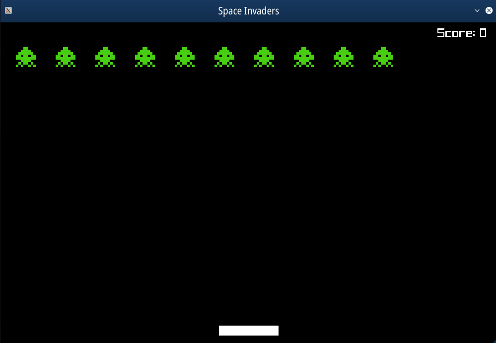

# Space Invaders

A space invaders clone built in C++ using the Raylib framework.

The game is verified to work on Debian Linux (Buster)

You will need to install the following in order to build the program:

- https://github.com/RobLoach/raylib-cpp (cpp raylib bindings / Rob Loach)  
- https://github.com/raysan5/raylib (cpp raylib is a header-only library; must be linked to raylib)  
- https://gcc.gnu.org/ (Tested with version 8.3.0)  



## How to build

```
g++ -o bin/space-invaders src/*.cpp  -std=c++17 -Iinclude -g -L<path to:libraylib.a> -lraylib -l GL -l m -l pthread -l dl -l rt -l X11

```

## Resources

https://www.raylib.com/cheatsheet/cheatsheet.html  
https://en.cppreference.com/w/  

## Further Work

The base framework for the game loop is mostly complete; however
there remain additional elements to implement before completion:

- ~~Fail condition is still pending (The player cannot 'die').~~
- ~~The aliens do not speed up, giving the player little challenge.~~
- ~~No score; the player cannot accumulate score giving them no target to aim for.~~
- ~~No sound; the game currently has no sound effects or music, this is sucky.~~
- Code refactoring:
    - ~~Functions should be split out.~~
    - ~~Resource Manager to further abstract code.~~
    - ~~Split out Draw and Update loops to relevant classes.~~
